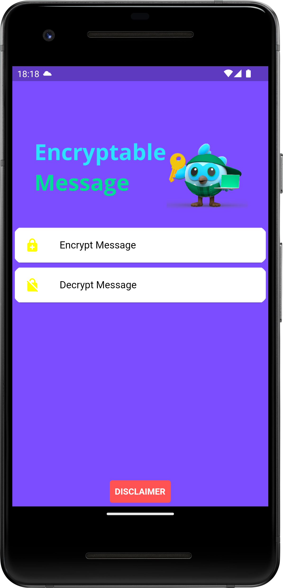
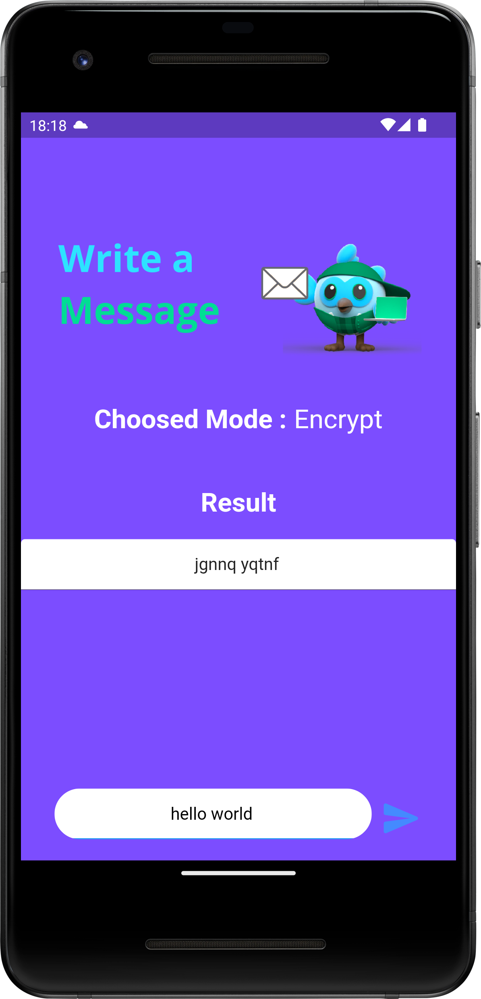
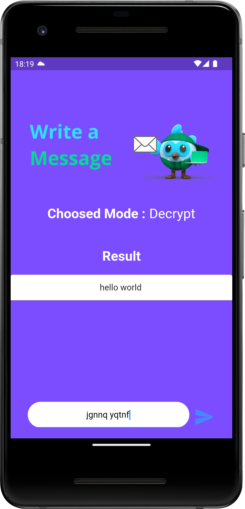

 


 # Encryptable Message
An android application written in dart that helps to share encrypted messages.

# Platform Tested Compatibility

- [x] android
- [x] iOS

# Dependencies
All plugins used on this project
```
dependencies :
  flutter_launcher_icons: ^0.11.0

```

# Permissions
All permissions required for this application
```

```

 # Screens



